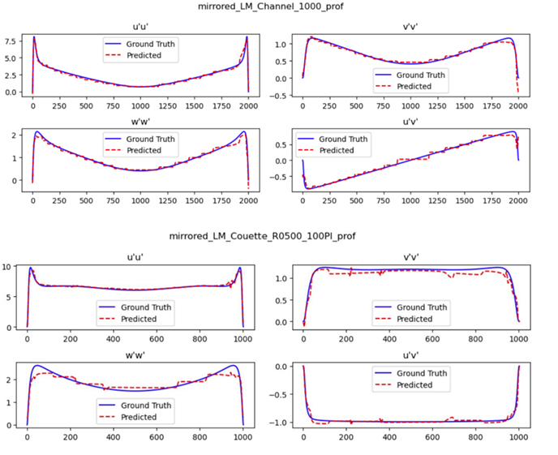
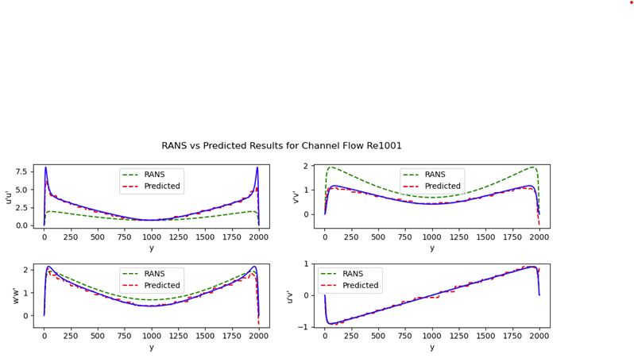

# **Leveraging Neural Networks & Machine Learning for RANS Model Discovery**

## **Project Overview**

This project introduces a novel hybrid framework that combines **Sparse Identification of Non-Linear Dynamics (PySINDy)** with **Physics-Informed Neural Networks (PINNs)** to enhance turbulence modeling within **Reynolds-Averaged Navier-Stokes (RANS)** simulations. Traditional RANS models, which are widely used in computational fluid dynamics, often struggle with the accurate prediction of **Reynolds Stress Tensors** in turbulent flows, particularly when compared to **Direct Numerical Simulation (DNS)** data.

Key components of this project include:
  
1. **Data Preprocessing**: The DNS and RANS data are preprocessed through mirroring and interpolation techniques to overcome the issue of incomplete datasets, ensuring better quality and consistency during model training. 
2. **PySINDy for Governing Equation Discovery**: By applying PySINDy, simplified governing equations are derived from DNS data, offering a more accurate representation of the physical phenomena that are then embedded in the neural network models.
3. **Physics-Informed Neural Networks (PINNs)**: The PINNs are trained to predict Reynolds stresses while embedding physical constraints derived from DNS data and the SINDy-discovered equations. The use of PINNs ensures that the neural network predictions remain consistent with fundamental physical laws.
4. **Results Validation**: The trained models are evaluated by comparing predictions against RANS and DNS results for both **Poiseuille** and **Couette** flows at varying Reynolds numbers, showcasing significant improvements in accuracy.

This project significantly reduces the **Root Mean Square Error (RMSE)** for the Reynolds Stress Tensors compared to traditional RANS models, achieving up to **81.29% RMSE reduction** for unseen channel data and **90.3% RMSE reduction** for Couette flow data.

The following research questions are addressed in this project:

- **Can PySINDy successfully discover governing equations that improve turbulence prediction for RANS models?**
- **How can Physics-Informed Neural Networks enhance traditional RANS models?**
- **What improvements in accuracy can be achieved by integrating DNS data into turbulence modeling?**

This framework bridges traditional turbulence models with modern machine learning techniques, presenting a more robust approach to turbulence prediction in practical engineering applications.

---

## **Repository Structure**

```bash
Leveraging_NN_ML_for_RANS_Model_Discovery/
│
├── Images/                                      # Contains figures and visual results used in the project
│   ├── Figure1.png                              # First figure showing data comparison
│   ├── Figure2.png                              # Neural network architecture
│   ├── Figure3.png                              # Example of Reynolds stress tensor results
│   └── ...
│
├── Neural Networks Codes/                       # Contains all neural network models and scripts
│   ├── PINN/                                    # Physics-Informed Neural Network model
│   │   ├── DNS_data/                            # DNS data used for PINN training
│   │   ├── model_files/                         # Model files for the PINN
│   │   ├── Result_Comparison/                   # Comparison between DNS and RANS results
│   │   ├── results/                             # Results of the PINN model predictions
│   │   ├── Save_models/                         # Saved models from training
│   │   ├── Data_Preprocessing.ipynb             # Data preprocessing notebook
│   └── Simple Neural Network/                   # Basic neural network models for RANS predictions
│       ├── K Optimisation/                      # Scripts for optimizing the K factor
│       └── Keras Reynold Stress Tensor Predictor # Keras-based neural network models for stress tensor prediction
│
├── PySINDy Codes/                               # PySINDy scripts for discovering governing equations from DNS data
│   └── pysindy_equations.ipynb                  # Jupyter notebook for generating equations using PySINDy
│
├── Report.pdf                                   # Full project report, detailing the methodologies and results
├── README.txt                                   # ReadMe file explaining the project
└── Scientific_Paper.pdf                         # Related scientific paper detailing the use of PINNs in RANS modeling
```
----

## **System Requirements**

The project requires a system with adequate computational resources to handle the large datasets and intensive model training. Below are the recommended hardware and software specifications to run the project efficiently.

### **Hardware Requirements**
- **Minimum RAM**: 8 GB (16 GB recommended)
- **Processor**: Quad-core processor or higher (for better parallel processing during model training)
- **Storage**: At least 10 GB of free disk space for datasets, model files, and results
- **GPU (optional but recommended)**: CUDA-compatible GPU for faster training of neural networks, particularly when using TensorFlow and PyTorch.

### **Software Requirements**
- **Operating System**: Windows, macOS, or Linux
- **Python Version**: Python 3.8 or higher is required due to dependencies on newer libraries like TensorFlow and PySINDy.

----

## **Tools and Libraries Used**

This project utilizes a combination of open-source tools and libraries for data preprocessing, equation discovery, and machine learning model training. The following tools and libraries were essential for implementing the framework:

### **Programming Languages**
- **Python 3.8+**: The primary programming language used for this project. Python was chosen for its versatility and strong support for data science and machine learning libraries.

### **Libraries for Data Processing and Visualization**
- **NumPy**: For efficient array and matrix operations, crucial for handling the large datasets generated by DNS and RANS models.
- **Pandas**: Used for data manipulation, handling, and preprocessing of the DNS and RANS datasets.
- **Matplotlib**: For generating visualizations, including figures comparing DNS, RANS, and PINN predictions.
- **Seaborn**: Used for statistical data visualization, enhancing the readability of plots, particularly during result analysis.
- **Plotly**: For creating interactive visualizations of the model results, especially during the comparison of RANS and DNS predictions.

### **Machine Learning Libraries**
- **TensorFlow**: The main framework for building and training the **Physics-Informed Neural Networks (PINNs)**. It provides the deep learning architecture needed to implement neural networks and auto-differentiation.
- **PyTorch**: Another deep learning framework used in the project to experiment with neural network models, especially during prototyping.
- **Keras**: A high-level API for TensorFlow, used for building the simpler neural networks for RANS modeling.
  
### **Scientific and Analytical Tools**
- **SciPy**: For numerical integration and solving differential equations, especially during the discovery of governing equations from DNS data.
- **SymPy**: For symbolic computation, used to handle the mathematical expressions derived by the PySINDy model.
- **PySINDy**: A core tool for this project, used to identify simplified governing equations from DNS data. PySINDy plays a key role in discovering underlying physical phenomena.
  
### **Jupyter Notebook**: Used extensively throughout the project for experimenting with models, documenting findings, and visualizing results in a structured and interactive environment.

To install all the required libraries, you can run the following command:

```bash
pip install -r requirements.txt
```

---

## **Data Description**

The project utilizes **DNS data** for **Channel** and **Couette** flows at various **Reynolds numbers** ranging from 182 to 5200 for channels and from 93 to 543 for Couette. The data is crucial in training and validating the models.

### Key Variables:
- **Mean Velocity Fields** (U, W)
- **Streamwise Velocity Gradients** (dU/dy)
- **Reynolds Stresses** (u'u', v'v', w'w', u'v')
- **Turbulent Kinetic Energy** (k)
- **Pressure Fields** (P)

---
## **Methodology**

### **1. Data Collection and Preprocessing**

The project relies on **Direct Numerical Simulation (DNS)** data for both **Poiseuille** and **Couette** flows at various Reynolds numbers. However, the DNS data was incomplete, necessitating a thorough preprocessing phase to make the dataset suitable for training the machine learning models.

#### **1.1 Data Mirroring**

Since the dataset only covered half of the simulation domain, a **mirroring technique** was applied around the midpoint of the flow domain (y = 1). This method ensures symmetry in the data and increases data diversity, allowing for a more comprehensive dataset to train the model.

#### **1.2 Interpolation**

To further improve the dataset, **cubic spline interpolation** was used to fill in missing values and smooth transitions. This interpolation technique ensures that the DNS and RANS datasets are continuous and complete, providing better input for model training.

<p align="center">
  
</p>

In this figure:
- The **top panel** shows the raw data for DNS and RANS, which is incomplete and lacks coverage across the entire domain.
- The **bottom panel** demonstrates the mirrored and interpolated results, showing how data symmetry and continuity are achieved through these preprocessing steps.

This preprocessing step was crucial for ensuring the dataset was suitable for accurate neural network training.

### **2. Governing Equation Discovery Using PySINDy**

### **2. Governing Equation Discovery Using SINDy**

To improve the accuracy of turbulence predictions, we used **Sparse Identification of Nonlinear Dynamics (SINDy)** to derive governing equations from the **Direct Numerical Simulation (DNS)** data. The SINDy approach identifies simplified governing equations that constrain the **Physics-Informed Neural Network (PINN)** model, ensuring that the predictions adhere to physical laws.

#### **Equations Derived from SINDy**

The **x-momentum** and **y-momentum** equations discovered through SINDy are as follows:

- **X-Momentum Equation**:
  ```bash
  (1) (−dP/dx) − ρ (d(uv)/dy) + ν (d²U/dy²) = 0
  ```
- **Y-Momentum Equation**:
  ```bash
  (2) (−dP/dy) − ρ (dv'v'/dy) = 0
  ```
These simplified forms of the Navier-Stokes equations for turbulence are specialized for unidirectional flows. The SINDy model imposes physical constraints on the PINN, ensuring consistency with fluid dynamics principles.

#### **Training Dataset for SINDy**

The training dataset for the SINDy model consisted of three **channel flow** cases (Reynolds numbers 180, 1000, and 5200) and one **Couette flow** case (Reynolds 220 [100Pi]). These cases provided sufficient data for accurate equation derivation.

The SINDy model was optimized through feature selection, combining polynomial degree, alpha, and maximum iterations to minimize error while retaining only the most critical features. The derived equations closely matched the DNS results, significantly improving the prediction accuracy for Reynolds stresses.

The derived equations were then incorporated into the PINN to ensure that physical laws were embedded in the learning process.


### **3. Neural Network Architecture (PINN)**

The chosen architecture for the **Physics-Informed Neural Network (PINN)** is a **residual neural network**. This architecture is particularly well-suited for capturing complex relationships in the data, utilizing **residual connections** (also known as skip connections). These connections allow the network to mitigate the common vanishing gradient problem encountered in deep neural networks by facilitating the flow of information across layers.

<p align="center">
  
</p>

Residual connections, as shown in the figure above, help retain critical features across layers without degradation, which is essential for accurately modeling turbulent flow dynamics.

#### **Coupling SINDy Equations with the PINN Loss Function**

After defining the architecture, the next step is to couple the neural network with the governing equations derived from the **Sparse Identification of Nonlinear Dynamics (SINDy)** model. The governing equations (Eq. 10, 11, 12, and 13) are integrated into the network through the **loss function**.

The governing equations for **channel flow** and **Couette flow** are as follows:

- **X-Momentum Equation (Channel Flow)**:
  ```bash
  d²U/dy² + 1.057 d(uv)/dy - 272.974 = 0
  ```
- **X-Momentum Equation (Couette Flow)**:
  ```bash
  −(1/ρ) ∂P/∂x + ν ∂²U/∂y² − ∂(u'u')/∂y = 0
  ```
- **Y-Momentum Equation (Couette Flow)**:
  ```bash
  −(1/ρ) ∂²U/∂y² + ∂(v'v')/∂y = 0
  ```

#### **PINN Loss Function**
The PINN is trained by minimizing a **global loss function** that is composed of three individual losses:

- **MSE for Ground Truth (MSE_GT)**:
```bash
 MSE(Θ) = MSE_GT(Θ) + MSE_BC(Θ) + MSE_PDE(Θ)
```
The first term, **MSE_GT**, is the mean squared error between the predicted Reynolds Stress Tensor and the ground truth data:
```bash
Loss_GT = RST_NN − RST_GT
```
The second term, **MSE_BC**, enforces boundary conditions for the Reynolds Stress Tensor:
```bash
Loss_BC = RST(0)_NN − RST(0)_GT
```
The third term, **MSE_PDE(Θ)**, uses the momentum equations derived from the RANS model as physical constraints for the network, ensuring the PINN adheres to fluid dynamics principles:
```bash
Loss_momentum_x = momentum_x
Loss_momentum_y = momentum_y
```
<p align="center">  </p>
This architecture integrates both data-driven learning and physics-based constraints, resulting in a more accurate prediction of Reynolds stresses compared to traditional **Reynolds-Averaged Navier-Stokes (RANS)** models.

### **4. Model Training and Optimization**

The training process for the PINN model was split into **channel flow** and **Couette flow** cases, with training and testing datasets derived from **DNS** data. The training was structured as follows:

- **Channel Flow**: Reynolds numbers 180, 1000, and 5200.
- **Couette Flow**: Reynolds numbers 93 [20Pi], 220 [100Pi], 500 [100Pi], and 1000 [20Pi].

A total of six different PINN models were trained: three for channel flows, three for Couette flows. The models were trained with a hybrid approach that integrated both **SINDy**-based equations and **RANS**-based equations, each governing the respective flows. Each of the PINN models was trained with interpolated DNS data, ensuring that the models could predict values that closely matched DNS data.

#### **Unified Model**

The unified model was trained with features from both RANS and SINDy equations. However, this model struggled to differentiate between channel and Couette flows, resulting in suboptimal performance in accurately predicting both flow types.

<p align="center">
  
</p>

The figure above shows the results from the unified model trained using RANS-based equations for both flow types, where discrepancies between predicted and ground truth values can be observed.

<p align="center">
  
</p>

Similarly, the SINDy-based unified model was unable to fully capture the characteristics of both flows simultaneously, as seen in the figure.

#### **Split Model**

To overcome the challenges faced by the unified model, the dataset was split, and separate PINN models were trained for each flow type. The split model was able to predict the intrinsic features for both channel and Couette flows more accurately.

<table align="center">
  <tr>
    <th>Version</th>
    <th>Flow Type</th>
    <th>Rows (Training)</th>
    <th>Rows (Testing)</th>
  </tr>
  <tr>
    <td>Splitted RANS-based PINN</td>
    <td>Channel</td>
    <td>43412</td>
    <td>511</td>
  </tr>
  <tr>
    <td>Splitted RANS-based PINN</td>
    <td>Couette</td>
    <td>891</td>
    <td>355</td>
  </tr>
  <tr>
    <td>Splitted SINDy-based PINN</td>
    <td>Channel</td>
    <td>130000</td>
    <td>40000</td>
  </tr>
  <tr>
    <td>Splitted SINDy-based PINN</td>
    <td>Couette</td>
    <td>50000</td>
    <td>10000</td>
  </tr>
</table>

This split configuration allowed for better specialization in predicting the nuances of each flow. The table above summarizes the training and testing dataset sizes used for each model.

<p align="center">
  
</p>

<p align="center">
  
</p>

Both split models, as seen in Figures 15 and 16, significantly outperformed the unified model, especially in predicting flow characteristics near the wall regions.

#### **Hyperparameters and Configuration**

The split model for both RANS and SINDy-based PINNs was configured with the following hyperparameters:

- **Input**: 4
- **Hidden Layers**: 10
- **Neurons per Layer**: 64
- **Output**: 6
- **Activation Function**: Tanh
- **Learning Rate**: 2.5e-4
- **Optimizer**: Adamax
- **Epochs**: 2000

This configuration, as displayed in Table 7, ensured the models were adequately trained for each flow type, while retaining the generalizability needed to predict unseen test cases.

---
## **Results and Analysis**

The final **Physics-Informed Neural Network (PINN)** model, which incorporated both **SINDy** and **RANS** equations, demonstrated significant improvements in predicting the **Reynolds stresses** compared to RANS alone. This section discusses the key findings, performance metrics, and comparisons between **DNS**, **RANS**, and **PINN** predictions.

### **1. Final Model Results**

The final model combined elements from both the SINDy and RANS-based approaches, automating the execution of **Computational Fluid Dynamics (CFD)** simulations and the computation of Reynolds stresses using the **Boussinesq Hypothesis**. The model produced enhanced results, particularly in the computation of normal stresses for both **Channel** and **Couette flows**.

The model demonstrated a notable improvement in predicting the normal stress components, as highlighted in the table below:

| **Flow Type** | **Variable** | **PINN RMSE Improvement over RANS (%)** |
|---------------|--------------|-----------------------------------------|
| Channel       | u'u'         | 72.5%                                   |
| Channel       | v'v'         | 83.7%                                   |
| Channel       | w'w'         | 32.1%                                   |
| Couette       | u'u'         | 69.4%                                   |
| Couette       | v'v'         | 74.2%                                   |
| Couette       | w'w'         | 18.9%                                   |

The **PINN** significantly outperformed the **RANS** model in predicting the **Root Mean Square Error (RMSE)** for key stress components like **u'u'**, **v'v'**, and **w'w'** across multiple test cases for channel and Couette flows. Improvements were seen across all cases, with an average accuracy gain of over 70% for the channel flow variables.

### **2. Couette Flow Results**

For **Couette flow**, similar improvements were observed in the prediction of normal stresses. The RMSE values for Couette flow showed an improvement of 69.4% for **u'u'**, 74.2% for **v'v'**, and 18.9% for **w'w'** compared to traditional RANS predictions. These gains highlight the efficacy of the PINN model in capturing turbulent flow characteristics, particularly in near-wall regions.

<p align="center">
  
</p>

<p align="center">
  
</p>

### **3. Detailed Comparison of PINN, RANS, and DNS**

The following figures compare the performance of the PINN model with DNS and RANS for both **Channel Flow Re 1001** and **Couette Flow Re 500**. The PINN model demonstrates significantly improved accuracy, especially in regions near the wall, where traditional RANS models struggle.

<p align="center">
  
</p>

<p align="center">
  
</p>

### **4. Testing with New Reynolds Numbers**

To further validate the model, additional tests were conducted with a new **Reynolds number (Re 6000)** and a kinematic viscosity of 0.0016. The model's performance remained robust, with promising results in predicting stress behavior near the wall, as seen below:

<p align="center">
  
</p>

While the PINN model captured the near-wall behavior present in DNS data, some boundary condition discrepancies, particularly in the **v'v'** component, were observed. These limitations were more pronounced in the higher Reynolds number cases, though overall accuracy remained high.


---


### **4. Results Comparison**

The results from the **PINN** model were compared against traditional **RANS** and **DNS** data, with significant improvements in prediction accuracy.

<p align="center">
  
</p>

---

## **Key Results**

| Model Type   | RMSE Improvement (%) |
|--------------|----------------------|
| **Channel**  | 81.29%               |
| **Couette**  | 90.3%                |

<p align="center">
  
</p>

<p align="center">
  
</p>

---
## **Conclusion**
This project successfully leveraged a combination of **Physics-Informed Neural Networks (PINNs)** and **Sparse Identification of Nonlinear Dynamics (SINDy)** to enhance the accuracy of predicting **Reynolds stresses** in turbulent flows. By integrating both **Direct Numerical Simulation (DNS)** data and traditional **Reynolds-Averaged Navier-Stokes (RANS)** equations, the PINN model was able to overcome the limitations of purely data-driven or physics-driven approaches.

### **Key Takeaways:**

- The **PINN** model significantly improved the prediction of key turbulence variables such as **u'u'**, **v'v'**, and **w'w'**, achieving an average accuracy improvement of over 70% compared to the traditional RANS model.
- **SINDy**-discovered governing equations provided important physical constraints that ensured the PINN remained consistent with known fluid dynamics laws, leading to better generalization and accuracy.
- Splitting the dataset into **channel flow** and **Couette flow** cases allowed the PINN model to specialize and achieve higher accuracy for each specific type of flow.
- The model exhibited robust performance even when tested on higher **Reynolds numbers** (Re 6000), further validating its generalization capability.

### **Future Work:**

While the project demonstrated substantial improvements, there are several areas for further research:
- The **boundary condition discrepancies** observed near the wall in higher Reynolds number cases could be addressed by refining the loss functions or further tuning the neural network architecture.
- Exploring alternative machine learning architectures, such as **Convolutional Neural Networks (CNNs)**, could offer better spatial resolution for turbulent flow predictions.
- Expanding the dataset with additional Reynolds numbers and flow types may further enhance the model's generalization capabilities and reduce potential overfitting.

In conclusion, the hybrid approach of combining data-driven neural networks with physics-based constraints represents a powerful methodology for advancing turbulence modeling. This project sets the stage for future innovations in predictive modeling of complex fluid systems, where accuracy and physical consistency are both critical.

---
## **How to Run the Project**

1. Clone the repository:

   ```bash
   git clone https://github.com/Yass123krk/Portfolio.git
   cd Portfolio/Projects/Leveraging_NN_ML_for_RANS_Model_Discovery
   ```

2. Install the required Python packages:

   ```bash
   pip install -r requirements.txt
   ```

3. Run the Jupyter Notebook for data preprocessing:

   ```bash
   jupyter notebook Neural_Networks_Codes/PINN/Data_Preprocessing.ipynb
   ```

4. Train the PINN model:

   ```bash
   python Neural_Networks_Codes/PINN/train_PINN.py
   ```

5. View results and compare RANS and DNS:

   ```bash
   python Neural_Networks_Codes/PINN/compare_results.py
   ```

---

## **Contact Information**

For any inquiries or suggestions, feel free to contact me at [yassercranfield@gmail.com].

---

## **References**

1. M. Lee, R.D. Moser, "Direct numerical simulation of turbulent channel flow up to Re 5200", *Journal of Fluid Mechanics*, 774, 2015.
2. S. L. Brunton, J. L. Proctor, J. N. Kutz, "Discovering governing equations from data by sparse identification", *Proceedings of the National Academy of Sciences*, 2016.

